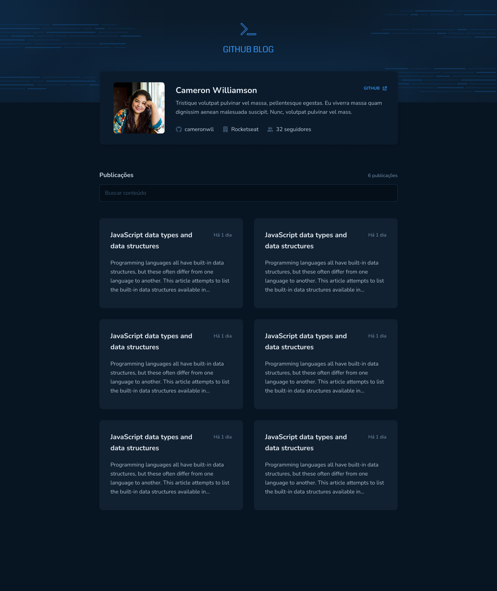
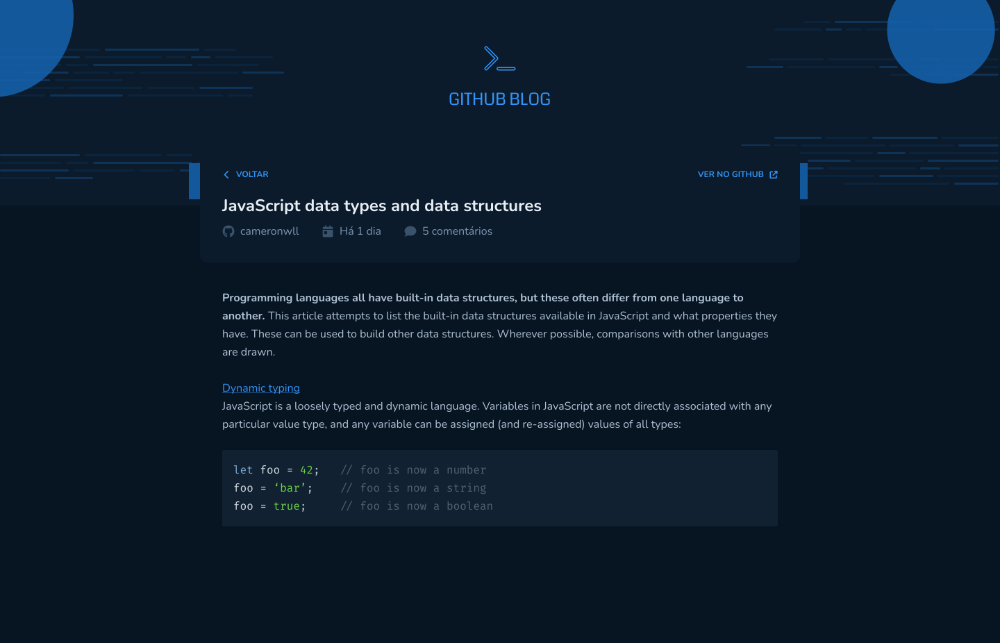

# Github blog - web site

<p align="center">
  <a href="#-projeto">Project</a> &nbsp;&nbsp;&nbsp;|&nbsp;&nbsp;&nbsp;
  <a href="#-tecnologias">Technologies</a> &nbsp;&nbsp;&nbsp;|&nbsp;&nbsp;&nbsp;
  <a href="#how-to-use">How to use</a> &nbsp;&nbsp;&nbsp;|&nbsp;&nbsp;&nbsp;
  <a href="#common-mistakes">Common mistakes</a> &nbsp;&nbsp;&nbsp;|&nbsp;&nbsp;&nbsp;
  <a href="#project-vision">Project vision</a> &nbsp;&nbsp;&nbsp;|&nbsp;&nbsp;&nbsp;
</p>

## 💻 Project

This project was built to support the study of how to develop applications in react, componetização, context and its features. It is applied concepts of components, properties, CRUD, api integration from github, manipulating issue data, github status, react markdown and dynamic routing with react-route.

## 🚀 Technologies

This project was developed with the following technologies:

- JavaScript
- TypeScript
- React
- React Markdown
- React Route
- Context API
- API Github
- Hooks
- Html
- Css

## How to use?

1. Download this repository and with your terminal, enter the directory

```
git clone SSH or HTTP
```

2. Select the folder you want to use first

```
cd folder
```

3. Run to install the dependencies

```
npm install OR yarn
```

4. And to start the application, run the command

```
npm start OR yarn start
```

## Common mistakes

1. Check if your node is on version 16.8 or node lts

# Project vision




<p align="center">Made by Pedro Henrique Lima</p>
